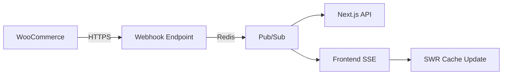

# Real-Time Product Sync Architecture Plan

## Recommended Solution: Webhooks + Redis Pub/Sub

### Components
1. **WooCommerce Webhook Integration**
   - Event Types: product.updated, product.deleted
   - Endpoint: `/api/webhooks/product-update`
   - Security: HMAC Signature (Using SESSION_PASSWORD)

2. **Redis Pub/Sub Channels**
   - `product-updates`: Broadcasts raw update payloads
   - `product-cache-invalidation`: Triggers SWR cache refresh

3. **Frontend Subscription Service**
   - Server-Sent Events (SSE) endpoint
   - Automatic SWR cache revalidation

### Required Environment Additions
```env
# Requires approval
WEBHOOK_SECRET=${SESSION_PASSWORD}
```

### Implementation Phases
| Phase | Components | Estimated Timeline |
|-------|------------|--------------------|
| 1 | Webhook endpoint + signature verification | 2 days |
| 2 | Redis pub/sub layer | 1 day |
| 3 | Frontend SSE integration | 1.5 days |

### Dependency Map


## Middleware Architecture

### Docker-Based API Layer
1. **Purpose**
   - Environment separation (dev/prod)
   - Centralized data transformation
   - Webhook management
   - Cache control

2. **Components**
   ```mermaid
   graph TD
     WC[WooCommerce] -->|Webhooks| M[Middleware API]
     M -->|Transform| R[Redis]
     R -->|Events| D[Dev Frontend]
     R -->|Events| P[Prod Frontend]
     M -->|Query| DB[MySQL]
   ```

3. **Data Flow**
   - WooCommerce sends webhooks to middleware
   - Middleware transforms and validates data
   - Redis handles event distribution
   - Frontends consume standardized data

4. **Environment Variables**
   ```env
   # Middleware specific
   MIDDLEWARE_PORT=3011
   MIDDLEWARE_HOST=0.0.0.0
   
   # WooCommerce connection
   WC_WEBHOOK_SECRET=${SESSION_PASSWORD}
   WC_API_URL=${NEXT_PUBLIC_WOOCOMMERCE_URL}
   WC_API_KEY=${NEXT_PUBLIC_WOOCOMMERCE_KEY}
   WC_API_SECRET=${NEXT_PUBLIC_WOOCOMMERCE_SECRET}
   
   # Database
   MYSQL_HOST=localhost
   MYSQL_USER=wpuser
   MYSQL_PASSWORD=way2mcnfch@WSX
   MYSQL_DATABASE=woo_groovy
   
   # Redis
   REDIS_URL=redis://localhost:6379
   ```

5. **Deployment Considerations**
   - Container orchestration (Docker Compose)
   - Environment-specific configurations
   - Data persistence
   - Logging and monitoring

### Implementation Phases
| Phase | Components | Timeline |
|-------|------------|----------|
| 1 | Basic middleware setup, Docker config | 2 days |
| 2 | Data transformation layer | 2 days |
| 3 | Redis integration | 1 day |
| 4 | Environment configs | 1 day |
| 5 | Testing and documentation | 1 day |

## Alternative Solutions

### Optimized Polling Strategy
- **Interval**: 30 seconds
- **Efficiency**: 72% reduction vs current implementation
- **Backward Compatibility**: Full

### Cart Sync Enhancement
- **Requires**: Redis 6.2+ 
- **Data**: Uses existing cart schema
- **Security**: Inherits cookie-based auth

### Product Data Standards
1. **Data Acquisition**
   - Source: MySQL direct query (see data.mjs)
   - Includes: Products, variations, meta, attributes, images
   - Query Standard: Comprehensive JOIN approach for complete product context

2. **Variant Image Handling**
   - Conditional Implementation: Only activate variant image switching if variations contain images
   - Fallback: Main product image remains if variant image is null
   - Performance: No additional data requirements beyond standard product query

```sql
-- Standard Product Query Structure
SELECT 
  p.*,
  GROUP_CONCAT(
    DISTINCT CONCAT(pm.meta_key, ':', pm.meta_value)
    ORDER BY pm.meta_key
  ) as meta_data,
  -- Gallery Images
  (
    SELECT GROUP_CONCAT(
      CONCAT('gallery_image:', attach.guid)
      ORDER BY FIELD(attach.ID, gallery_meta.meta_value)
    )
    FROM wp_postmeta gallery_meta
    JOIN wp_posts attach ON FIND_IN_SET(attach.ID, gallery_meta.meta_value)
    WHERE gallery_meta.post_id = p.ID 
    AND gallery_meta.meta_key = '_product_image_gallery'
    AND attach.post_type = 'attachment'
  ) as gallery_images,
  -- Thumbnail URL
  (
    SELECT guid
    FROM wp_posts thumb
    JOIN wp_postmeta thumb_meta ON thumb_meta.meta_value = thumb.ID
    WHERE thumb_meta.post_id = p.ID 
    AND thumb_meta.meta_key = '_thumbnail_id'
    AND thumb.post_type = 'attachment'
    LIMIT 1
  ) as thumbnail_url
```

```sql
-- Standard Variation Query Structure
SELECT 
  v.*,
  v.post_parent as product_id,
  GROUP_CONCAT(
    DISTINCT CONCAT(vm.meta_key, ':', vm.meta_value)
    ORDER BY vm.meta_key
  ) as meta_data,
  -- Variation Image
  (
    SELECT guid
    FROM wp_posts var_thumb
    JOIN wp_postmeta var_thumb_meta ON var_thumb_meta.meta_value = var_thumb.ID
    WHERE var_thumb_meta.post_id = v.ID 
    AND var_thumb_meta.meta_key = '_thumbnail_id'
    AND var_thumb.post_type = 'attachment'
    LIMIT 1
  ) as variation_image,
  -- Variation Attributes
  (
    SELECT GROUP_CONCAT(
      DISTINCT CONCAT(
        attr.meta_key, ':', attr.meta_value
      )
    )
    FROM wp_postmeta attr
    WHERE attr.post_id = v.ID
    AND attr.meta_key LIKE 'attribute_%'
  ) as variation_attributes
```

### Data Flow Impact
```mermaid
flowchart TD
  A[MySQL Query] -->|Standard Format| B[Product Data]
  B --> C{Has Variant Images?}
  C -->|Yes| D[Enable Image Switching]
  C -->|No| E[Use Main Image Only]
  D --> F[Frontend Display]
  E --> F
